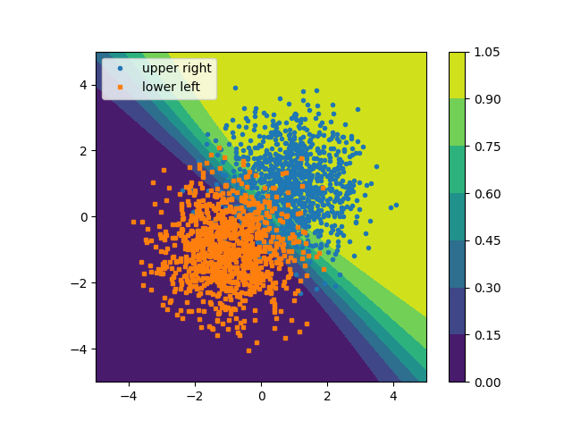

# Tutorial 02 Backprop
In this tutorial you will use the Educational Deep Learning Framework (EDF)

# Tasks
0. Create a Python virtual environment to run the code, and start a Jupyter server.
1. Go through the original EDF tutorial in the Jupyter [notebooks/MNIST_MLP_Example.ipynb](notebooks/MNIST_MLP_Example.ipynb). Make clear to yourself, what happens in the functions `run_epoch` and `train`. Execute the cells, until the training is executed and plot the result graph with the cell below. Can you explain why the test error is lower than the train loss? Write your answer into a file `answer.txt` (1 Point).
2. Open the Jupyter Notebook [notebooks/BinaryClassifier.ipynb](notebooks/BinaryClassifier.ipynb). Copy and paste the required code from the MNIST example, make very small adaptations and train your first classifier (3 Point). Save and commit your notebook. The result should look similar to this

3. Open the Jupyter Notebook [notebooks/CurveFittingWithMLP.ipynb](notebooks/CurveFittingWithMLP.ipynb). Your task is to implement a method that fits a curve with a Neural Network. Steps are given in the Notebook. Save and commit the notebook (6 Points). 

# Acknowledgement
This tutorial was made possible with the Educational Deep Learning Framework (EDF) as presented in the course TTIC 31230. He kindly gave permission to use his teaching material. The source is here https://github.com/mcallester/ttic-31230